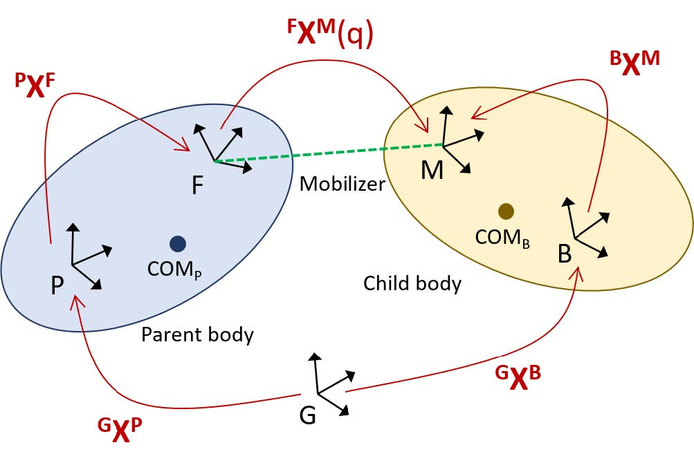
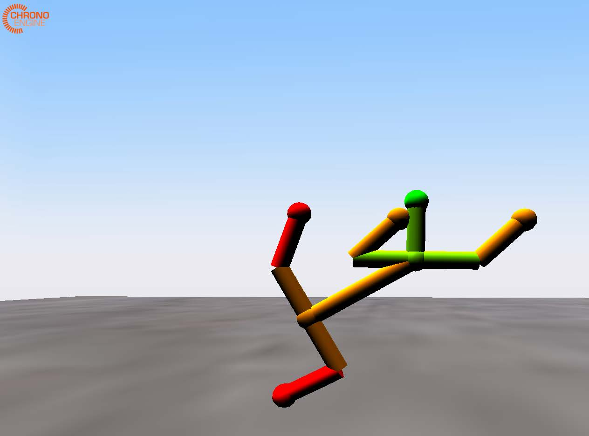

# Chrono 的 OpenSim 解析器

## 1.介绍

本报告简要概述了 [Chrono](https://github.com/projectchrono/chrono) 解析 OpenSim 输入文件的功能，并包含一个带有代码示例的基本使用指南。

OpenSim 的多体动力学功能基于开源的 [Simbody](https://simtk.org/projects/simbody) 软件包，该软件包采用内部坐标系的递归公式，这与 Chrono 中使用的全坐标系笛卡尔公式截然不同。从概念上讲，笛卡尔公式和递归多体公式的主要区别在于对连接刚体的机械关节的抽象解释：在笛卡尔公式中，关节被建模为限制相对运动的约束集合；相反，在递归公式中，机械关节被解释为一种驱动装置，它能够产生一定数量的相对自由度。

用于构建多体系统的基本 Simbody 组件包括：

* 身体（质量特性和几何形状）
* 活动器（内坐标关节）
* 约束
* 力

前两个部分组合成 MobilizedBody 结构，它表示刚体及其内部动员器（定义了刚体相对于其父体的自由度）。

[OpenSim](https://github.com/opensim-org/opensim-core) 模型可以通过编程方式构建，也可以通过基于 XML 格式的 [osim 输入文件](https://github.com/opensim-org/opensim-models) 进行指定。此处描述的 Chrono 功能会解析此类 osim 输入文件，以创建等效的 Chrono 机械系统，或者使用 osim 输入文件中指定的元素填充现有的 Chrono 系统。


## 2.背景

我们将从帧 A 到帧 B 的位置变换定义为：

$$
^A \mathbf{X} ^B = [ ^A \mathbf{R} ^B; ^A \mathbf{t} ^B ]
$$

其中 \( ^A \mathbf{R} ^B \) 表示 3 × 3 旋转(Rotation)矩阵，\( ^A \mathbf{t} ^B \) 表示两个坐标系原点之间的平移(translation)向量。因此，逆变换可推导如下：

$$
^B \mathbf{X} ^A = ( ^A \mathbf{X} ^B ) ^{-1} 
        = [ ( ^A \mathbf{R} ^B )^{-1};  ( ^A \mathbf{R} ^B )^{-1} \cdot ^A \mathbf{t} ^B ]
$$

由此，坐标系 B 中的位置向量 \( ^B \mathbf{v} \) 可以用以下公式在坐标系 A 中表示：

$$
^A \mathbf{v} = ^A \mathbf{X} ^B \cdot ^B \mathbf{v}
\equiv
^A \mathbf{R} ^B \cdot ^B \mathbf{v} + ^A \mathbf{t} ^B
$$

Simbody 开环多体系统从根体(root body)开始递归定义。给定父体 \( P \) 的状态，动体(MobilizedBody) \( B \) 的广义状态完全由以下方式定义：
$$
^P \mathbf{X} ^B = [ ^P \mathbf{R} ^B; ^P \mathbf{t} ^B ]
$$

$$
^P \mathbf{V} ^B = ^P \mathbf{H} ^B \cdot u
$$

$$
\dot{q} = \mathbf{N} (q) u
$$

其中 \( ^P \mathbf{H} ^B \) 是用于获得 6×1 空间速度 \( ^P \mathbf{V} ^B \) 的速度变换矩阵，\( N \) 是运动学耦合矩阵，表示广义速度与广义（内部）坐标的导数之间的关系。


Chrono 多体系统由一系列物体和约束条件构成，这些约束条件模拟了连接物体之间的机械关节。状态向量是物体在笛卡尔坐标系中的位置和速度的集合，所有位置和速度均相对于绝对（地面）参考系表示。



如上图所示，给定一个 MobilizedBody 形式的 Simbody 表示，物体 \( ^G \mathbf{X} ^B \)（在地面坐标系 G 中表示并相对于地面坐标系 G 表示）的绝对变换可确定为：

$$
^G \mathbf{X} ^B
    = 
    ^G \mathbf{X} ^P \cdot
    ^P \mathbf{X} ^F \cdot
    ^F \mathbf{X} ^M (q) \cdot
    ^M \mathbf{M} ^B
$$

其中，\( ^G \mathbf{X} ^P \) 是父体的绝对变换，\( ^P \mathbf{X} ^F \) 表示父体外侧关节的位置（在 \( P \) 坐标系中表示），\( ^F \mathbf{X} ^M (q) \) 是动子体的变换（在机械关节的固定坐标系和运动坐标系之间，由特定动子体的内部坐标参数化），\( ^B \mathbf{X} ^M \) 是子体上 -1 内侧关节的位置（在 \( B \) 坐标系中表示）。注意，\( ^M \mathbf{X} ^B = ( ^B \mathbf{X} ^M ) ^{-1} \) 。


Simbody 系统采用分层定义，每个 MobilizedBody 都指定其类型以及父体和子体上的动员位置（分别为 \( ^P \mathbf{X} ^F \) 和 \( ^B \mathbf{X} ^M \) ），以及体属性（例如质量、惯性张量、质心位置等）。此外，osim 模型规范提供初始内部坐标和速度值。解析器根据动员类型推断相应的 Chrono 关节，以及初始构型 \( q_0 \)  的变换 \( ^F \mathbf(X) ^M (q_0) \) 。换句话说，一个 Simbody MobilizedBody 会创建一个 Chrono 体和一个 Chrono 关节。生成的体的初始位置使用上一公式，根据其父体已计算的位置计算得出。


## 3.实现和使用


Chrono 的 osim 文件解析器封装在一个名为 [`ChParserOpenSim`](https://github.com/projectchrono/chrono/blob/main/src/chrono_parsers/ChParserOpenSim.cpp) 的类中，该类位于 `chrono::parsers` 命名空间下。Chrono 用户可以在其主程序中实例化此类型的对象，并使用它来解析给定的 `osim` 文件，从而在 `ChSystem` 中创建输入文件中指定的建模元素（实体、关节、力等）。


解析器使用 [RapidXML](https://github.com/Fe-Bell/RapidXML) 读取 XML 文件，RapidXML 是一个基于 MIT 许可证的开源 C 库。RapidXML 读取 osim 文件并进行原地解析，因此使用起来既快捷又简单。读取完成后，它会创建 XML 文件的树状表示。Chrono 解析器遍历这棵树，读取惯性矩和质量等通用仿真数据，然后读取物体信息。如有需要，它还可以从 osim 文件中读取其他字段。osim 文件的格式在 [OpenSim 用户指南](https://opensimconfluence.atlassian.net/wiki/spaces/OpenSim/overview) 中有详细描述。


解析器接收指向递归树根节点的指针。它假定该树是非循环的（即，表示一个没有闭合回路的机械系统），尽管一个节点可以有多个子节点。它选择根节点作为“地面”节点，该节点固定在地面上。所有节点都以递归方式定义，它们的相对位置和方向由其父节点的位置和方向以及其内侧关节的特定变换决定。

目前，解析器仅处理初始位置，忽略初始内部运动器速度，并将其设置为 0。处理初始速度信息要复杂得多，因为它需要在 `ChParserOpenSim` 中实现所有已知关节的速度变换 \( ^F \mathbf{H} ^M \) 。尽管如此，我们将在未来的扩展中考虑此选项。


### 3.1 刚体

出于效率考虑，Chrono 中的默认物体参考系是质心参考系。因此，与 `ChBody` 关联的标记、关节、可视化资源和碰撞形状必须相对于位于物体质心的参考系进行定义。为了便于建模，Chrono 提供了一个派生类 `ChBodyAuxRef`，允许指定物体相对于任意（可能非质心）参考系。由于 Simbody 中的 *MobilizedBodies* 是相对于任意参考系定义的，因此 ChParseOpenSim 生成的所有物体都是 `ChBodyAuxRef` 类型。这消除了在解析过程中进行额外参考系变换的需要。


### 3.2 支持的关节类型

以下 Simbody 关节在 Chrono 中都有直接对应的关节，因此可以完全解析：

* 旋转关节（又称销轴关节）

* 球形关节（又称球窝关节）

* 万向节（又称卡丹关节）

* 焊接关节（零自由度关节）

无法识别的 Simbody 关节会被替换为 Chrono 球形关节；在这种情况下，关节变换 \( ^F \mathbf{X} ^M \) 会被正确解析和计算，因此子身体会被初始化为正确的配置。以黑盒形式外部实现的自定义 Simbody 关节也会被替换为Chrono 球形关节，并且它们的关节变换会被设置为恒等变换。


### 3.3 力和执行器元件

目前，`Simbody` 力元素尚未被解析和解释（例如，`PrescribedForce`、`SpringGeneralizedForce` 和 `BushingForce`）。

OpenSim 还包含“理想”执行器，它们通过其最佳力设置（即增益）施加与输入控制（即激励）成正比的纯力或扭矩。这些力和扭矩可以施加在单个物体上，也可以施加在两个物体之间。`ChParserOpenSim` 目前可以解析和解释以下内容：

- 点执行器**PointActuator**：在指定点沿指定方向对给定物体施加力；施加点和力的方向均可在绝对参考系或物体局部参考系中提供。

- 扭矩执行器**TorqueActuator**：对两个物体绕指定轴施加大小相等、方向相反的扭矩；扭矩方向可以在绝对坐标系或物体局部参考系中给出。

解析器将这些执行器转换为 Chrono loads(负载)，Chrono 负载是对可施加于各种 Chrono 建模元素（包括刚体）的力和扭矩的概括。具体来说，`PointActuator` 被转换为 `ChLoadBodyForce`，而 `TorqueActuator` 被转换为 `ChLoadBodyBodyTorque`。Chrono 负载被收集到所谓的负载容器(load containers)中，类型为 `ChLoadContainer`。从 OpenSim 执行器解析出的所有负载都收集到单个负载容器中（一个 `ChSystem` 可以包含任意数量的此类容器）。

在 OpenSim 中，激励函数可以通过多种方式指定：可以直接在 `.osim` 文件中指定，也可以在单独的**控制**文件（XML 格式）中指定，并在 `.osim` 文件中引用该文件。对于前者，OpenSim 还提供了一个简单的语法，允许用户为这些激励指定各种数学函数。为了简化解析过程并提供更大的灵活性，我们选择允许用户通过 Chrono 的 `ChFunction` 机制在 Chrono 中原生指定自己的激励函数。`ChFunction` 基类定义了一个单变量的抽象标量函数 (y = f(x))，并提供了一组相对丰富的具体派生类（包括多项式、正弦、分段线性等）；此外，用户还可以通过定义自己的派生 `ChFunction` 类来扩展此集合（详情请参阅 Chrono API 参考文档）。

默认情况下，遵循 OpenSim 的设计理念，所有转换后的执行器均不被激励（换句话说，它们的激励函数为常数 0）。用户也可以选择在解析过程之前调用 `parser.ActivateActuators(true)`，使所有 Chrono 执行器负载都具有完全激励（即，激励函数为常数 1）。解析完成后，可以通过 `ChParserOpenSim::SetExcitationFunction()` 设置特定执行器的激励，如清单 1 所示。清单 1 中，执行器的名称通过其在 .osim 文件中的名称来引用（也可以通过 3.7 节中描述的报告对象访问）。解析器目前会忽略上述未列出的执行器类型，但用户可以通过 `ChParserOpenSim::Report::GetBody()` 找到相关的执行器，并在它们之间创建自定义力。

```cpp
auto excitation = std::make_shared<ChFunction_Ramp>(0, 1);
parser.SetExcitationFunction( "grav" , excitation );
```


### 3.4 可视化

用户可以控制生成的 Chrono 体的可视化方式。以下选项可用：

- **none** 不创建任何可视化资源（这是默认设置）

- **primitives** 使用 Chrono 的基本可视化资源，为每个身体创建一个可视化模型。该模型由一个以身体参考系原点为中心的球体和连接身体参考系与所有相邻关节位置（内侧关节和所有外侧关节）的圆柱体组成。参见下图中的示例。

    

- **mesh** 使用可视化网格，假定网格以 Wavefront `obj` 文件的形式提供，并在输入 osim 文件中的 `<geometry_file>` 标签下指定。参见下图中的示例。

    


### 3.5 碰撞和接触

默认情况下，生成的 Chrono 实体不会创建碰撞几何体。如果启用此功能，则会根据基本圆柱体形状创建碰撞模型，类似于 `PRIMITIVES` 模式下的可视化形状。由于这意味着相邻实体的碰撞形状会在连接关节处重叠，因此实体会根据其在树状层次结构中的深度，被分配到交替的碰撞族中。实体与其父实体之间不会生成碰撞；允许与任何其他实体（包括同级实体）发生碰撞。

Chrono 支持两种接触处理方法：**非光滑、基于互补性的**(non-smooth, complementarity-based, NSC)方法和**光滑、基于惩罚的**(SMC, smooth, penalty-based)方法。具体方法取决于包含 ChSystem 的类型。ChParserOpenSim 类中的可选方法允许指定接触材料属性（参见 [chrono api](http://api.chrono.projectchrono.org/index.html) ）。

### 3.6 样例使用

示例 2 展示了如何解析 osim 文件以填充现有的 Chrono 系统。使用方法如下：

```cpp
ChSystemSMC my_system;
std::stringfilename = GetChronoDataFile("opensim/skeleton.osim");
ChParserOpenSimparser;
parser.SetVisualizationType (ChParserOpenSim::VisType::PRIMITIVES);
parser.EnableCollision();
parser.SetVerbose(true);
parser.Parse(my_system, filename);
```

```cpp
/// 报告包含有关从文件中解析的对象的信息
class ChApi Report {
public :
/// 从 OpenSim 读取关节数据的信息。
struct JointInfo {
std::string type;               ///< 关节类型如osim文件中所示
std::shared_ptr<ChLink> joint;  ///< Chrono 连杆 (关节)       
bool standin;                   ///< 关节替换成球形关节？
};

/// 关于使用 OpenSim 创建的自定义负载的信息。
struct ForceInfo {
std::string type;                 ///< 负载类型如osim文件中所示
std::sharedptr<ChLoadBase> load ; ///< Chrono 加载对象
};

std::unordered_map<std::string, std::shared_ptr<ChBodyAuxRef>> bodies;
///< 身体信息列表
std::unordered_map<std::string, JointInfo> joints;
///< 关节信息列表
std::unordered_map<std::string, ForceInfo> forces;
///< 力列表的信息
```

1. 创建解析器对象；
2. 设置解析选项；
3. 调用解析方法之一。

清单 2 中的前两行创建了 `ChSystem` 来保存生成的模型，并指定了要解析的文件名。第三行创建了解析器对象；第四行将其设置为使用图元进行可视化（详见下文）。接下来的三行在解析器中设置标志，以确定可视化、接触和调试输出。默认行为是不显示可视化图像、不进行碰撞检测，也不输出详细信息。最后一行将 `filename` 指定的文件解析到 `my_system` 中。还有一个替代函数 `ChParserOpenSim::Parse`，它接受文件名和 `ChMaterialSurface::ContactMethod` 参数，以创建一个具有此接触类型的合适系统，将文件解析到该系统中，并返回指向新系统的指针。


### 3.7 报告

`ChParserOpenSim::Report` 类为用户提供了一个接口，用于访问从 `.osim` 文件解析出的刚体、关节和力。解析过程中会创建一个报告对象，用于以元素名称哈希的映射表形式存储 Chrono 刚体、关节和载荷列表。相关数据结构如清单 3 所示。`ChParserOpenSim::Report` 提供了用于打印报告以及按名称访问刚体、关节和载荷的方法。可以通过 `ChParserOpenSim::GetReport()` 访问解析器的报告。

### 3.8 当前限制

* 初始速度假定为零。
* 未识别的关节（包括自定义关节）被放置在正确的初始位置，但被替换为球形关节，从而导致不同的运动学。
* 自定义关节的移动器坐标系 (FXM(q)) 设置为恒等变换，从而产生不同的初始姿态。

## 4. 将来可能的扩展

目前，`ChParseSimBody` 仅解释和解析 osim 文件中有效属性的一个子集。这使得可以创建等效的 Chrono 模型，这些模型由刚体（带有可选的可视化资源和碰撞形状）、一组已识别的关节（即，在 Sim-body 中有直接对应的 Chrono 关节）和简单的执行器（`PointActuator` 和 `TorqueActuator`）组成。


未来可能扩展的功能包括：解析和创建标记、其他力元素（例如，广义弹簧力），以及解析和解释初始内部坐标速度。


### 4.1 支持肌肉模型

目前 OpenSim – Chrono 解析器的功能仅能创建和模拟人体骨骼的底层运动学模型，对驱动的支持非常有限，而且肯定不够完善。未来的扩展需要包含肌肉和肌腱的模型，这就需要实现 Chrono 目前尚不具备的功能；具体而言：

* 基于肌腱特征曲线的肌肉致动器。此类力单元既可以实现为独立的、特定领域的 C++ 类层次结构，也可以利用现有的 `ChLoader` 机制。ChLoader 机制允许在 Chrono 系统中定义可加载单元（例如，实体和/或网格）上的通用集中载荷或分布式载荷。例如，前一种方法的实现方式类似于 Chrono 中当前通用弹簧阻尼力单元的实现，例如 `ChLinkSpringCB` 类，该类允许用户通过提供的函子对象指定任意力。作为后一种方法的示例，我们提到在有限元分析网格上实现接触力（通过 ChLoadContactSurfaceMesh），或者在 Chrono::Vehicle 模型中通过基于 ChLoaderPressure 类型表面加载器的载荷实现内部轮胎压力。在这两种情况下，实现方式都可以提供基于特征曲线（主动力长度、被动力长度、力速度和肌腱力长度）的预定义 Hill 型肌肉力模型，同时还可以通过回调机制兼容用户提供的肌肉模型。

* 肌腱长度和路径的几何计算。需要额外的 Chrono 支持来表征和处理与肌腱复合体末端与骨骼的连接点、肌腱路径和过道点相关的几何信息，以及肌腱长度的计算。这些功能可以作为 Chrono 几何实用程序（位于 chrono::geometry 命名空间中）的扩展来实现，并且可以选择性地包含在碰撞和接触处理中。


我们建议将 Chrono 的建模和仿真功能扩展到生物力学系统，并将其封装在一个可选模块中（例如 Chrono:Biomechanics）。类似于专门用于灵活快速地对地面车辆系统进行建模的 Chrono::Vehicle 模块，未来的 Chrono::Biomechanics 模块可以提供生物力学系统的模板，用于表示具有固定已知拓扑结构的参数化多体系统模型。


### 5. ChParserOpenSim 文档

这里列出 ChParserOpenSim 类中一些比较重要的函数。更多详情请参阅 [Project Chrono API 文档](http://api.chrono.projectchrono.org/index.html) 。


<br>


解析指定的 OpenSim 输入文件，并在给定的系统中创建模型。

```cpp
void chrono:: utils ::ChParserOpenSim::Parse(
    ChSystem& system,
    const std :: string& filename
)
```

参数：

* **system** : 包含 Chrono 系统

* **filename** : osim 输入文件名

解析指定的 OpenSim 输入文件，并在新系统中创建模型。请注意，解析器的析构函数不会删除创建的系统；而是将所有权转移给调用者。

```cpp
ChSystem∗ chrono::utils::ChParserOpenSim::Parse(
    const std :: string& filename,
    ChMaterialSurface::ContactMethod method = ChMaterialSurface::NSC
)
```

参数：

* **filename**: osim 输入文件名

* **method**: 接触方法（非光滑、基于互补性(non-smooth, complementarity-based, NSC)的方法；光滑、基于惩罚(smooth penalty-based, SMC)的方法）


<br>


启用此模型中实体间的碰撞检测（默认值：false）。设置碰撞族可以禁用实体与其父实体之间的碰撞检测。

```cpp
void chrono:: utils ::ChParserOpenSim::EnableCollision(
    int family_1 = 1,
    int family_2 = 2
)
```

参数：

* **family_1**: 第一个碰撞族

* **family_1**: 第二个碰撞族


<br>


设置身体可视化类型。

```cpp
void SetVisualizationType(VisType val)
```

参数：

* **val**: 可视化模式（默认：NONE）

可视化模式可以是以下几种之一：

* **PRIMITIVES** 使用可视化图元，例如圆柱体

* **MESH** 使用通过 Wavefront 输入文件指定的网格

* **NONE** 不进行可视化。


激活执行器。默认情况下，从 osim 文件读取的任何执行器都处于非活动状态（零激励）。如果启用，所有执行器都将接收值为 1 的恒定激励函数。解析后，可以使用 `SetExcitation-Function()` 函数指定执行器的激励函数。

```cpp
void ActivateActuators (bool val)
```

参数：

* **val**: 启用/禁用自动全激活

<br>

为指定名称的执行器设置激励函数。此方法仅在解析 osim 文件后才能调用。

```cpp
void SetExcitationFunction(
    const std :: string& name,
    std::shared_ptr<ChFunction> modulation
)
```

参数：

* **name**: 执行器（负载）的名称
* **modulation**: 用于提供激励信号的函数对象

## 参考

- [Chrono OpenSim 解析器手册](https://sbel.wiscweb.wisc.edu/wp-content/uploads/sites/569/2018/06/TR-2017-08.pdf) - 源于 [技术报告列表](https://sbel.wisc.edu/publications/technicalreports/)
